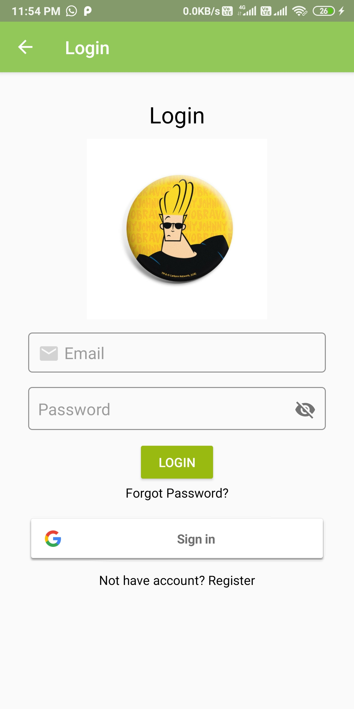
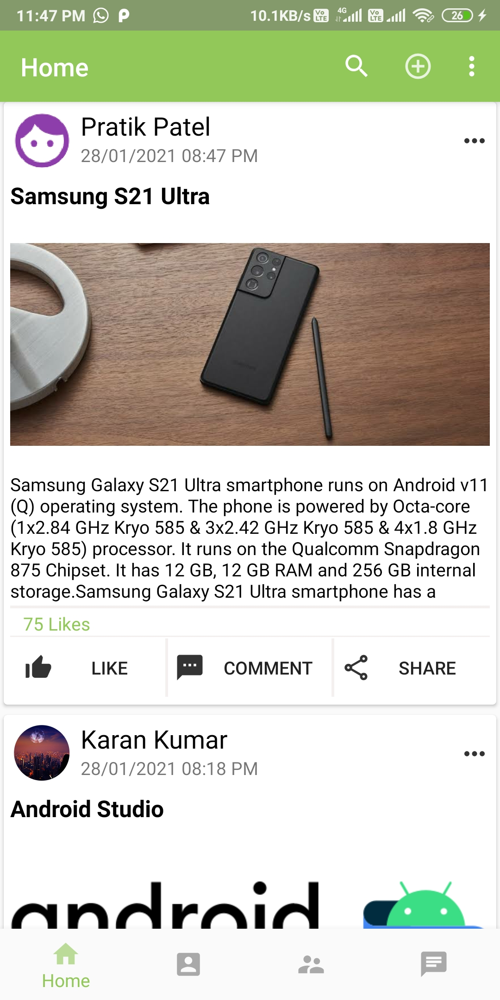
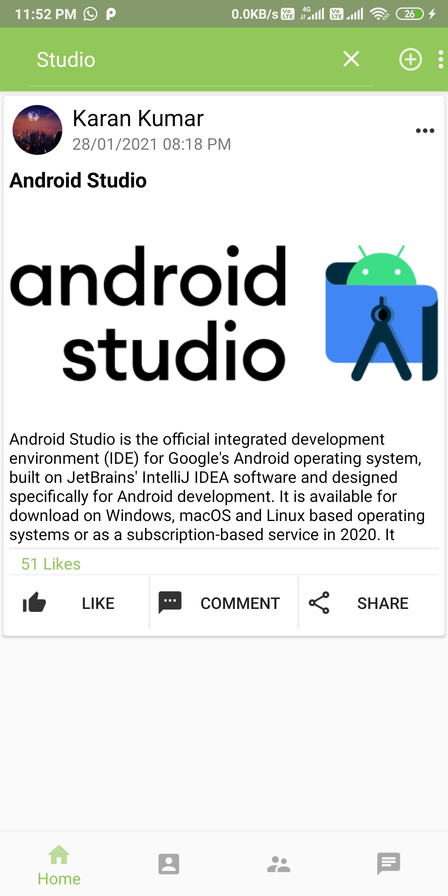
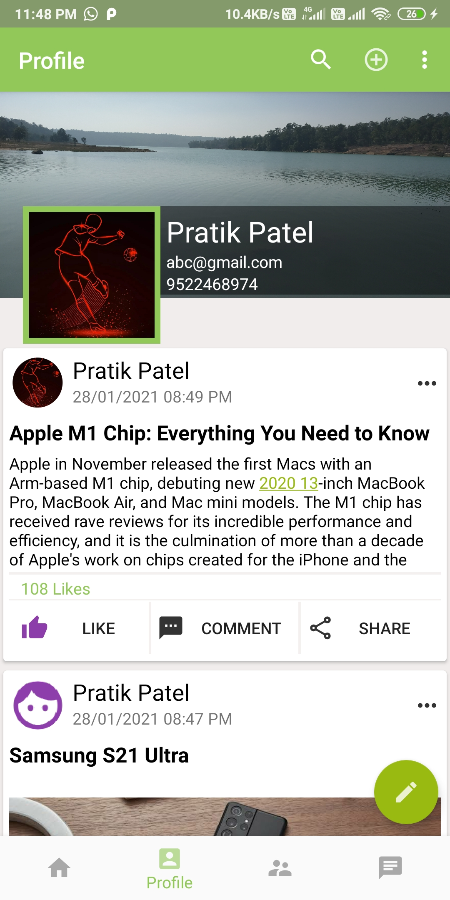
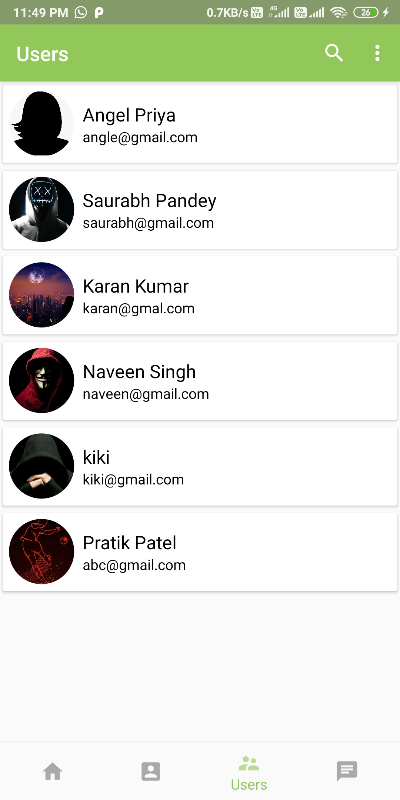
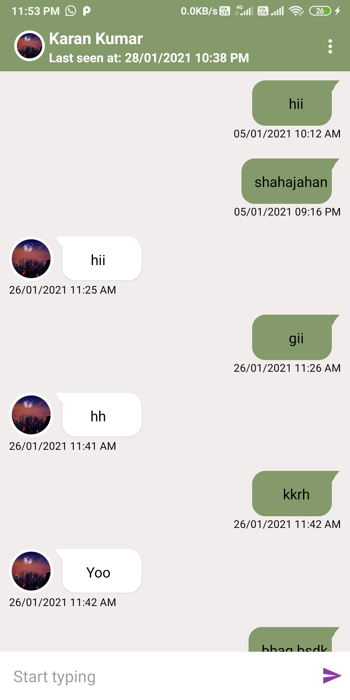
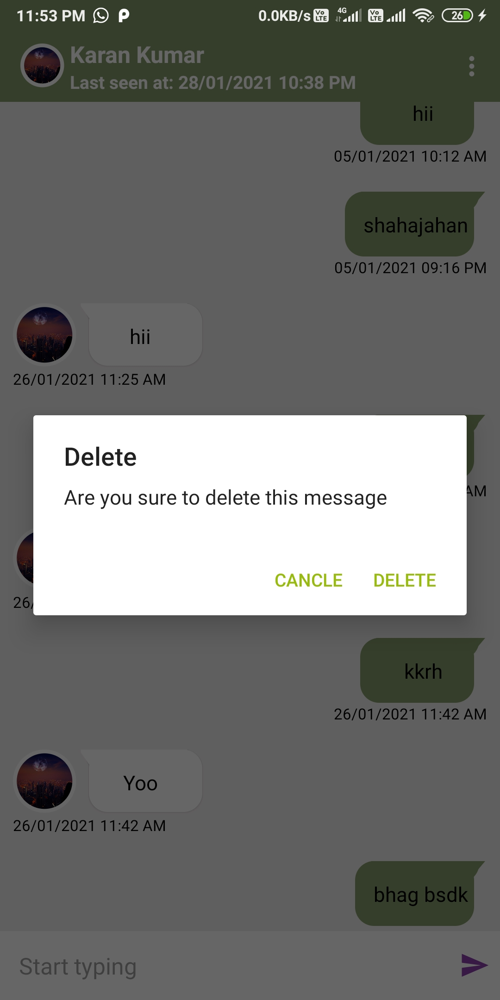

# Hello :wave:
Welcome to **Chit Chat App** Project. It is a E-grocery shop. 
An android application sharing posts and instant messaging. 
## Technology/ Stack used :mortar_board:
- Java 
- XML
- firebase
- Android Studio

## Screenshots :camera:

|                       Login Page                     |                            Blogs                      |                       Add Posts                       |
| :--------------------------------------------------: | :---------------------------------------------------: | :---------------------------------------------------: |
|                   |                    |               |

|               Edit and delete post                   |                   Search post by title                |                     User Profile                      |
| :--------------------------------------------------: | :---------------------------------------------------: | :---------------------------------------------------: |
|             |                   |                  |

|                         Users list                   |                       Personal Chat                   |                      Delete Chats                     |
| :--------------------------------------------------: | :---------------------------------------------------: | :---------------------------------------------------: |
|                   |                     |                   |

<!--
## APK :iphone:
[Apk link](https://drive.google.com/file/d/1Z2uGWXdqhYIySatzZamZ1dXoEPbhzhcM/view?usp=sharing) -->

## Features :clipboard:
&nbsp;&nbsp;&nbsp;&nbsp;&nbsp;1.Share daily blogs and posts. 
&nbsp;&nbsp;&nbsp;&nbsp;&nbsp;2.Likes and comments on posts. 
&nbsp;&nbsp;&nbsp;&nbsp;&nbsp;3.Share posts with other users. 
&nbsp;&nbsp;&nbsp;&nbsp;&nbsp;4.Personal chat with other users. 
&nbsp;&nbsp;&nbsp;&nbsp;&nbsp;5.Delete messages. 
&nbsp;&nbsp;&nbsp;&nbsp;&nbsp;6.Block unwanted users. 
